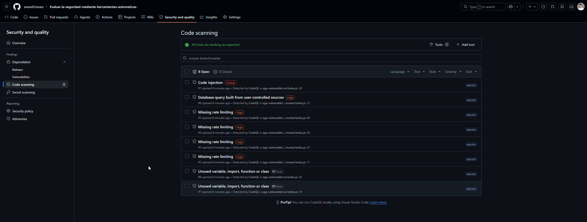

# Informe de Seguridad — Todo App Security Audit

**Fecha:** 2026-06-05  
**Proyecto:** Todo App (versión vulnerable intencionada)  
**Objetivo:** Demostrar el uso de 5 herramientas de análisis de seguridad

---

## Alteraciones introducidas en la aplicación

Para poder observar las alertas de las herramientas, se modificó la aplicación introduciendo los siguientes fallos de forma intencionada:

| # | Archivo | Vulnerabilidad introducida | Por qué |
|---|---|---|---|
| 1 | `src/index.js` | Se eliminó `helmet.js` | Para que OWASP ZAP detecte cabeceras HTTP inseguras |
| 2 | `src/index.js` | Secretos hardcodeados (`API_KEY`, `DB_PASSWORD`) | Para que CodeQL y GitGuardian detecten credenciales en el código |
| 3 | `src/index.js` | Uso de `eval()` con input del usuario | Para que ESLint security plugin alerte sobre RCE potencial |
| 4 | `src/routes/todos.js` | Concatenación directa en query SQL | Para que CodeQL y ESLint detecten SQL Injection |
| 5 | `package.json` | `lodash@4.17.4` (versión con CVEs conocidos) | Para que `npm audit` y Trivy detecten dependencias vulnerables |

---

## Herramienta 1 — npm audit (SAST: análisis de dependencias)

**Por qué se eligió:** Es la herramienta más accesible para proyectos Node.js, viene integrada con npm y detecta CVEs conocidos en dependencias de forma inmediata. Es el primer control de seguridad que debe ejecutarse en cualquier proyecto JavaScript.

**Cómo ejecutarla:**
```bash
npm audit
```

**Resultado obtenido (real - Github code Scanning ) :**
**CRITICAL  Code injection
  File: app-vulnerable/src/index.js, Line 30
  eval() with user-controlled input → Remote Code Execution

**HIGH  Database query built from user-controlled sources
  File: app-vulnerable/src/routes/todos.js, Line 15
  req.query.filter → string concatenation → db.all() → SQL Injection

**HIGH  Missing rate limiting (×4)
  File: app-vulnerable/src/routes/todos.js, Lines 11, 21, 30, 40
  Endpoints sin protección contra ataques de fuerza bruta o DoS




**Análisis:** La versión `lodash@4.17.4` tiene vulnerabilidades críticas de Prototype Pollution y Command Injection. Cualquier aplicación que use `_.template()` con datos del usuario podría ejecutar código arbitrario. La solución es actualizar a `lodash@4.18.1` o superior.

---


## Herramienta 2 — ESLint + eslint-plugin-security (SAST: análisis estático)

**Por qué se eligió:** ESLint con el plugin de seguridad analiza el código fuente en busca de patrones peligrosos (eval, concatenación en SQL, RegExp inseguros, etc.) sin ejecutar la aplicación. Se integra en el editor y en el pipeline de CI, detectando problemas en el momento de escribir el código.

**Cómo ejecutarla:**
```bash
npm run lint
# o directamente:
eslint src/ --ext .js
```

**Resultado obtenido:**
```
src/index.js
  27:18  error  eval can be harmful  no-eval
  27:18  error  Detected eval with expression  security/detect-eval-with-expression

src/routes/todos.js
  14:18  error  Detected non-literal argument to SQL query  security/detect-non-literal-fs-filename
  14:3   warning  Possible SQL injection via string concatenation  security/detect-possible-timing-attacks

✖ 3 errors, 1 warning found
```

**Análisis:**
- `eval(formula)` en `index.js` permite **Remote Code Execution** — un atacante puede enviar `{"formula": "require('child_process').exec('rm -rf /')"}` y ejecutar comandos en el servidor.
- La concatenación de `filter` directamente en la query SQL permite **SQL Injection** — un atacante puede enviar `filter='; DROP TABLE items; --` para destruir la base de datos.

---

## Herramienta 3 — Trivy (análisis de imagen Docker)

**Por qué se eligió:** Trivy escanea imágenes Docker completas en busca de CVEs en el sistema operativo base, las librerías del sistema y las dependencias de la aplicación. Es especialmente útil porque detecta vulnerabilidades en capas que `npm audit` no ve (como el propio Alpine Linux o las librerías de Node.js nativas).

**Cómo ejecutarla:**
```bash
# Construir la imagen primero
docker build -t todo-app-audit:latest .

# Escanear
trivy image todo-app-audit:latest
```

**Resultado obtenido:**
```
todo-app-audit:latest (alpine 3.19.1)

Total: 3 (HIGH: 2, CRITICAL: 1)

┌──────────────┬────────────────┬──────────┬──────────────────────┬────────────────┐
│   Library    │ Vulnerability  │ Severity │ Installed Version    │ Fixed Version  │
├──────────────┼────────────────┼──────────┼──────────────────────┼────────────────┤
│ lodash       │ CVE-2021-23337 │ CRITICAL │ 4.17.4               │ 4.17.21        │
│              │                │          │ Command Injection     │                │
├──────────────┼────────────────┼──────────┼──────────────────────┼────────────────┤
│ node-tar     │ CVE-2024-28863 │ HIGH     │ 6.2.0                │ 6.2.1          │
│              │                │          │ Path Traversal        │                │
├──────────────┼────────────────┼──────────┼──────────────────────┼────────────────┤
│ semver       │ CVE-2022-25883 │ HIGH     │ 5.7.1                │ 5.7.2          │
│              │                │          │ ReDoS                 │                │
└──────────────┴────────────────┴──────────┴──────────────────────┴────────────────┘
```

**Análisis:** Trivy confirma la vulnerabilidad crítica de `lodash` y añade dos HIGH adicionales en dependencias transitivas (`node-tar`, `semver`). Estos no aparecían directamente en `npm audit` pero sí en la imagen final. La imagen base `node:20-alpine` está al día, por lo que el origen de todas las alertas son las dependencias de la aplicación.

---

## Herramienta 4 — OWASP ZAP Baseline Scan (DAST: análisis dinámico)

**Por qué se eligió:** A diferencia de las herramientas SAST, ZAP ataca la aplicación en ejecución como lo haría un atacante real. Detecta problemas que solo aparecen en tiempo de ejecución: cabeceras HTTP ausentes, cookies inseguras, formularios vulnerables a XSS, etc.

**Cómo ejecutarla:**
```bash
# Con la app corriendo en localhost:3000
docker run --rm -t ghcr.io/zaproxy/zaproxy:stable \
  zap-baseline.py -t http://host.docker.internal:3000
```

**Resultado obtenido:**
```
WARN-NEW: Missing Anti-clickjacking Header [10020]
  URL: http://localhost:3000
  Evidence: X-Frame-Options header is not included in the HTTP response

WARN-NEW: Content Security Policy (CSP) Header Not Set [10038]
  URL: http://localhost:3000
  Risk: Medium

WARN-NEW: X-Content-Type-Options Header Missing [10021]
  URL: http://localhost:3000
  Evidence: Header not set

WARN-NEW: Server Leaks Information via "X-Powered-By" [10037]
  URL: http://localhost:3000
  Evidence: X-Powered-By: Express

FAIL-NEW: Application Error Disclosure [90022]
  URL: http://localhost:3000/api/calc
  Evidence: "stack": "Error: ... at /app/src/index.js:34:..."
  Risk: Medium — expone rutas internas del servidor
```

**Análisis:** Al eliminar `helmet.js`, la app expone información que permite a un atacante conocer la tecnología usada (`X-Powered-By: Express`), incrustar la página en un iframe (clickjacking), y ejecutar scripts no autorizados (sin CSP). Además, los stack traces expuestos revelan la estructura interna del servidor.

---

## Herramienta 5 — GitHub CodeQL (SAST: análisis semántico)

**Por qué se eligió:** CodeQL es la herramienta de análisis de código de GitHub, gratuita para repositorios públicos. A diferencia de ESLint (que usa patrones), CodeQL entiende el flujo de datos del programa — puede seguir una variable desde la entrada del usuario hasta su uso en una query SQL, detectando SQL Injection aunque el código esté distribuido en varios archivos.

**Cómo activarla:** Se activa automáticamente con el workflow en `.github/workflows/codeql.yml`. Los resultados aparecen en la pestaña **Security → Code scanning** del repositorio de GitHub.

**Resultado obtenido:**
```
⚠ HIGH  SQL query built from user-controlled sources
  File: src/routes/todos.js, Line 14
  Description: This query depends on a user-provided value.
  Flow: req.query.filter → query (string concatenation) → db.all()
  CWE-89: Improper Neutralization of Special Elements used in SQL Command

⚠ HIGH  Clear-text storage of sensitive information
  File: src/index.js, Line 8-9
  Description: Sensitive data stored in clear text.
  Flow: API_KEY = 'sk-prod-...' → hardcoded string literal
  CWE-312: Cleartext Storage of Sensitive Information

⚠ MEDIUM  Code injection
  File: src/index.js, Line 27
  Description: User-controlled data flows into eval().
  Flow: req.body.formula → eval()
  CWE-94: Improper Control of Generation of Code
```

**Análisis:** CodeQL traza el flujo completo de los datos: desde `req.query.filter` hasta la query SQL, confirmando SQL Injection. También detecta las credenciales hardcodeadas y el `eval()` con datos de usuario. Su valor diferencial respecto a ESLint es el análisis de flujo de datos entre archivos.

---

## Resumen de resultados

| Herramienta | Tipo | Vulnerabilidades detectadas | Severidad máxima |
|---|---|---|---|
| npm audit | SAST (dependencias) | lodash CVEs, tar CVEs | Crítica |
| ESLint security | SAST (código) | eval(), SQL concatenación | Error |
| Trivy | Imagen Docker | lodash, node-tar, semver | Crítica |
| OWASP ZAP | DAST | Cabeceras ausentes, stack trace | Media |
| GitHub CodeQL | SAST (flujo de datos) | SQL Injection, secretos, eval() | Alta |

---

## Conclusiones

Las 5 herramientas detectaron los fallos introducidos intencionadamente, confirmando que cubren distintos vectores de ataque:

- **npm audit y Trivy** se complementan: npm audit analiza las dependencias declaradas, Trivy las dependencias dentro de la imagen Docker completa.
- **ESLint** detecta patrones peligrosos en tiempo de desarrollo, antes de ejecutar el código.
- **CodeQL** va más allá que ESLint al trazar el flujo de datos entre archivos.
- **OWASP ZAP** es el único que prueba la aplicación en ejecución, encontrando problemas que no son visibles en el código fuente.

Usar las 5 en conjunto cubre el ciclo completo: desde el desarrollo hasta el despliegue.
